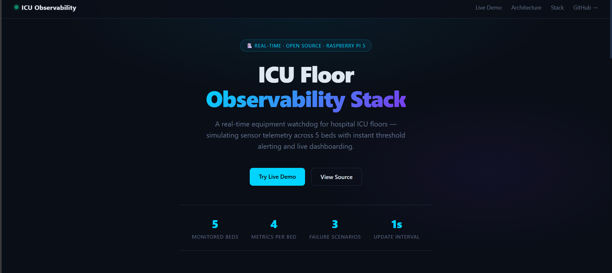

# ICU Floor Observability Stack
 
A real-time equipment watchdog simulation for hospital ICU floors, built on a **Raspberry Pi 5** using open-source observability tooling. Demonstrates metric ingestion, threshold alerting, and live dashboarding — the same primitives used in production infrastructure monitoring.


 
---
 
## What it does
 
Simulates sensor telemetry from ICU equipment across 5 beds on a hospital floor. A hospital admin can see at a glance which beds are nominal (green) and which have a critical failure (red) — without needing any technical knowledge.
 
**Monitored signals per bed:**
- Oxygen supply (PSI)
- Life support power (Watts)
- Battery backup (%)
- Device heartbeat (online/offline)
**Triggerable failure scenarios:**
- `oxygen_leak` — PSI drops from 55 → 5 over ~30 seconds
- `power_failure` — mains power cuts, battery drains to 0
- `device_offline` — heartbeat goes to 0 (device unresponsive)
---
 
## Architecture
 
```
clinic_simulator.py
        |
        v
OpenTelemetry Collector  (port 4317/4318)
        |
        v
VictoriaMetrics          (port 8428)
        |
        v
Grafana Dashboard        (port 3000)
 
Vector (log pipeline)    (port 8686)
        |
        v
VictoriaMetrics
```
 
All components run as Docker containers on a Raspberry Pi 5 (aarch64 / Debian).
 
---
 
## Stack
 
| Component | Role |
|---|---|
| OpenTelemetry Collector | Receives metrics from simulator via OTLP gRPC |
| VictoriaMetrics | Time-series storage, Prometheus-compatible |
| Grafana | Live dashboard with color thresholds and alerting |
| Vector | Log pipeline (demo mode) |
| Python OTel SDK | Pushes simulated sensor metrics |
 
---
 
## Hardware
 
- Raspberry Pi 5 (4GB or 8GB)
- Any Linux host with Docker also works
---
 
## Setup
 
### 1. Clone the repo
 
```bash
git clone https://github.com/jaimalharsk/icu-observability-stack.git
cd icu-observability-stack
```
 
### 2. Start the stack
 
```bash
docker compose up -d
```
 
### 3. Install Python dependencies
 
```bash
pip install opentelemetry-sdk opentelemetry-exporter-otlp-proto-grpc --break-system-packages
```
 
### 4. Verify VictoriaMetrics is up
 
```bash
curl http://localhost:8428/health
# Expected: OK
```
 
### 5. Open Grafana
 
Navigate to `http://<your-pi-ip>:3000` — default login is `admin / admin`.
 
Add VictoriaMetrics as a Prometheus data source: `http://victoriametrics:8428`
 
---
 
## Running the simulator
 
### Normal state (all beds nominal)
 
```bash
python3 clinic_simulator.py normal
```
 
### Trigger an oxygen leak on bed 1
 
```bash
python3 clinic_simulator.py oxygen_leak --bed bed_1
```
 
### Trigger a power failure on bed 2
 
```bash
python3 clinic_simulator.py power_failure --bed bed_2
```
 
### Trigger a device going offline on bed 3
 
```bash
python3 clinic_simulator.py device_offline --bed bed_3
```
 
After each scenario, run `normal` to reset all beds to safe values.
 
---
 
## Dashboard
 
The Grafana dashboard (`ICU Floor 1`) shows all 4 metrics across all 5 beds using color-coded stat panels:
 
- **Green** = within safe range
- **Red** = critical threshold breached
**Thresholds:**
 
| Metric | Safe | Critical |
|---|---|---|
| Oxygen PSI | ≥ 30 | < 30 |
| Life Support (Watts) | ≥ 100 | < 100 |
| Battery Backup (%) | ≥ 20 | < 20 |
| Device Heartbeat | 1 (online) | 0 (offline) |
 
---
 
## Alerting
 
Grafana alert rules fire when thresholds are breached, evaluated every 1 minute. Alerts are routed to a configurable contact point (webhook, email, etc.).
 
---
 
## Project context
 
Built as a demonstration of observability infrastructure skills targeting roles in infrastructure engineering and platform reliability. The stack mirrors real-world patterns: instrumented applications pushing metrics via OTel, a Prometheus-compatible TSDB for storage, and Grafana for visualization and alerting.
 
The simulation runs on a Pi 5 to demonstrate resource-constrained deployment — the same stack scales horizontally to production infrastructure with minimal config changes.
 
---
 
## License
 
MIT
